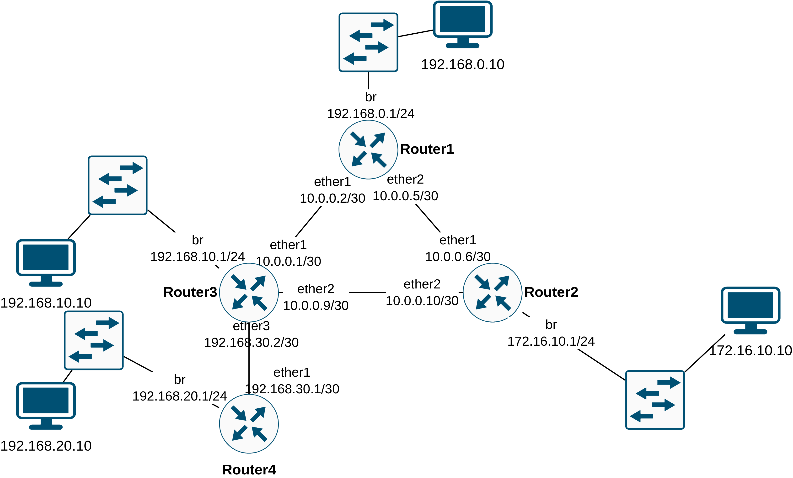

# MikroTik

## Zusammenfassung der verwendeten Befehle

| Befehl                                         | Zweck / Erklärung                                            |
| ---------------------------------------------- | ------------------------------------------------------------ |
| `/system/reset-configuration no-defaults=yes`  | **Router zurücksetzen:** Löscht die gesamte Konfiguration vollständig ohne Standard-Einstellungen. |
| `/export` (der geht überall) (selbe wie print) | **Konfiguration anzeigen:** Gibt die aktuell aktive Konfiguration im Terminal aus. |
| `/system reboot`                               | **Neustart:** Startet den Router neu (erforderlich nach Installation von Paketen oder Firmware-Updates). |
| `/system/routerboard/print`                    | **Firmware-Status:** Zeigt Details zum Routerboard sowie die aktuell installierte und verfügbare Bootloader-Firmware an. |
| `/system/routerboard/upgrade`                  | **Firmware aktualisieren:** Führt das Upgrade der Hardware-Firmware (Bootloader) durch. |
| `/system/package/update/check-for-updates`     | **Online-Update prüfen:** Prüft direkt online nach neuen Updates und lädt diese herunter *(setzt eine aktive Internetverbindung des Routers voraus)*. |

| Befehl                                                  | Zweck                                                        |
| ------------------------------------------------------- | ------------------------------------------------------------ |
| /system/identity/set name=Router1                       | um dem Router einen Namen zu vergeben                        |
| /ip/address/add address=`?` interface=ether`?`          | um einem interface eine selbst gewählte ip addresse zuzuweisen |
| /ip/route/print                                         | hier sehe ich welche addressen configuriert sind             |
| /ip/address/print                                       | hier sehe ich die fix eingetragenen addressen mit index      |
| /ip/address/remove number=`?`                           | die number ist der index beginnend mit 0                     |
| /interface/bridge/add name=br                           | um einen switch zu erstellen mit dem namen br                |
| /interface/bridge/port/add bridge=br interface=ether`?` | hier weise ich dem switch einen port zu                      |
| /ip/route/add dst-address=`?`(mit `/`) gateway=`?`      | statisches routen                                            |

