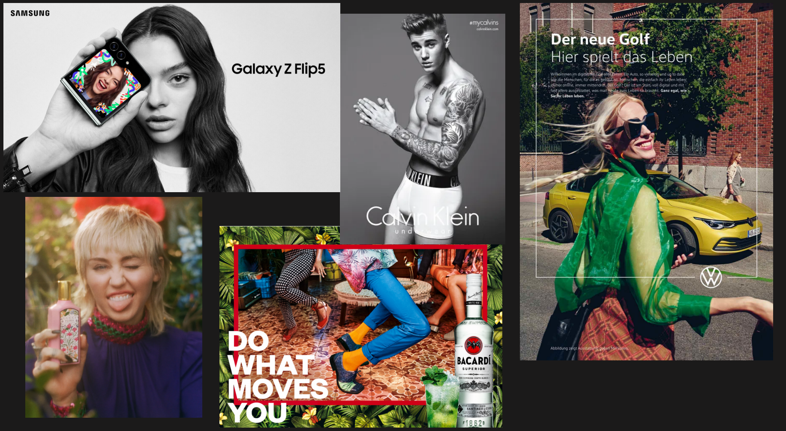

# Wirtschaft und Religion

### [1_Konsumgüter](1_Konsumgüter.pdf)

### [1_AB_Konsumgüter](1_AB_Konsumgüter.pdf)

## Bist du, was du hast?
**Analysieren Sie, welche Sehnsüchte des Menschen in den Bildern angesprochen
werden und mit welchen Mitteln die beworbenen Güter als attraktiv dargestellt werden.**

- **Samsung:** Sehnsucht nach Selbstinszenierung durch modernes Design.
- **Calvin Klein:** Sehnsucht nach Status & Attraktivität durch Promi-Testimonial (Justin Bieber).
- **VW Golf:** Sehnsucht nach Freiheit & Freiheit im Alltag („Hier spielt das Leben“).
- **Parfüm:** Sehnsucht nach Leichtigkeit & Schönheit (Miley Cyrus).
- **Bacardi:** Sehnsucht nach Spaß & Gemeinschaft („Do What Moves You“).

**Entfalten Sie, was Ihrer Meinung nach heutzutage für eine glückliche Existenz
notwendig ist.**

- Gesundheit (körperlich & mental)
- Echte soziale Kontakte (Familie & Freunde)
- Finanzielle Grundsicherheit
- Selbstbestimmung & Sinn im Leben

**Kann man Ihrer Meinung nach Glück kaufen?**

Nein. Geld nimmt Sorgen und schafft Freiräume, aber Liebe, Gesundheit und echter innerer Frieden sind unverkäuflich. Konsum bringt meist nur kurze Freude.

**Konsumismus =** Lebenshaltung, bei der das ständige Kaufen und Verbrauchen von Waren über den echten Bedarf hinaus zum Lebensinhalt wird.

**Eigentum =** Das Eigentum ist eine unverzichtbare Komponente und fungiert als Motor der Wirtschaft. 

**Leistung = ** Das Einkommen und das soziale Ansehen werden von der Leistung - und nicht von der Abstammung - abhängig gemacht (Leistungsprinzip). 

**Konsum = ** Der Begriff bezeichnet den Erwerb bzw. Verbrauch von Gütern zur Befriedigung persönlicher Bedürfnisse. 

**Materialismus =** Anschauung, die das Materielle als die einzig wahre Realität ansieht und besagt, dass die physische Welt dem Geist oder Bewusstsein vorausgeht. 

​	**Schattenseiten:** weniger Lebenszufriedenheit, Beziehungsprobleme, Psychischer Druck, Umweltzerstörung

**Welche Konsequenzen hat das derzeitige Konsumverhalten für den Einzelnen und wltweit?**

- **Einzelner:** Schulden, Stress, ständiger Vergleich, kurze Freude.
- **Weltweit:** Müllberge, CO₂-Ausstoß, Ressourcenknappheit, Ausbeutung.

**Welche Probleme können auftreten, wenn Eigentum, Leistung und Konsum zum Mittelpunkt des Lebens werden?**

- Dauerstress, Burnout-Gefahr, Verfall echter Beziehungen, Selbstwert hängt nur von Erfolg/Besitz ab.

**Welche Einstellung zum Einkaufen ist Ihrer Meinung nach anzustreben?**

- **Bewusst kaufen:** *Brauche ich das wirklich?*
- **Qualität statt Quantität:** Langlebig & nachhaltig.
- **Erlebnisse statt Zeug:** Geld lieber für Erfahrungen als Gegenstände nutzen.

**Ersetzen Sie das Wort "Kaufen" in der Karikatur durch andere Begriffe, die für Aspekte unserer Gesellschaft stehen, wie z. B. "ständige Erreichbarkeit". **

- **Vergleichskultur:** Das permanente Messen mit anderen auf Social Media.
- **Leistungsdruck:** Der Zwang, im Beruf und Alltag stets das Maximum zu liefern.
- **Selbstoptimierung:** Der Drang, Körper, Geist und Effizienz ununterbrochen zu verbessern.
- **Informationsüberfluss:** Die dauerhafte Berieselung durch News, Feeds und Benachrichtigungen.
- **Schnelllebigkeit:** Das Erwarten von sofortiger Belohnung und ständiger Veränderung.
- **Überkonsum:** Das ununterbrochene Anhäufen von Dingen und digitalen Inhalten.

### [3_Text_Kaufsucht](3_Text_Kaufsucht.pdf)

### SEITE 1

### SEITE 2

### SEITE 3

#### **Definition und Merkmale**

- **Hauptziel:** Das Kaufen dient weniger dem Erwerb nützlicher Güter, sondern vor allem dem **Erzeugen positiver Gefühle** (Stimmungsaufhellung, Kick).   
- **Gesellschaftliche Besonderheit:** Im Gegensatz zu anderen Süchten ist Kaufen sozial akzeptiert und erwünscht. Finanzielle Probleme können anfangs leicht kaschiert werden (z. B. durch Kreditkarten, Überziehen des Kontos).   
- **Medizinische Einordnung:** Kaufsucht wird meist als **„Störung der Impulskontrolle“** eingestuft. Im Englischen gibt es Begriffe wie *Compulsive Buying*, *Pathological Buying* oder *Shopping Addiction*.   
- **Entwicklung:** Kaufsucht entsteht schleichend über die Zwischenstufe des **„kompensatorischen Kaufverhaltens“** (z. B. Frustkäufe zur Bewältigung negativer Gefühle).   
- **Symptome / Suchtkriterien:**
  - Unwiderstehlicher Kaufdrang (über den eigenen Willen hinaus).   
  - Kontrollverlust, Verengung der Interessen nur auf das Kaufen, soziale Isolation und Überschuldung.   
  - Dosissteigerung (häufigere und teurere Einkäufe).   
  - Entzugserscheinungen (Unruhe, Unwohlsein, psychosomatische Beschwerden, Selbstmordgedanken).   
- **Gefahr:** Die Sucht bleibt oft lange unbemerkt oder wird verleugnet; erst schwerwiegende Folgen (Verschuldung, familiäre/psychische Probleme) führen zur Diagnose.   

#### **Screeningverfahren: Hohenheimer Kaufsuchtindikator (SKSK)**

- Im deutschsprachigen Raum ist der **Hohenheimer Kaufsuchtindikator** (auch *Screeningverfahren zur Erhebung von kompensatorischem und süchtigem Kaufverhalten*) das Standardinstrument zur Messung.   
- **Funktionsweise:** Der Test umfasst 16 Fragen (mit Bewertung von 1 = „trifft nicht zu“ bis 4 = „trifft zu“).   
- **Auswertung:**
  - **32 bis 44 Punkte:** Deutliche Kaufsuchtgefährdung (geprägt durch kompensatorisches Kaufverhalten).   
  - **Ab 45 Punkten (bis max. 64):** Starke Kaufsuchtgefährdung (de facto kaufssüchtig).   
- **Hauptauslöser:** Die stärkste Zustimmung erhalten Fragen, die das direkte Verlangen bzw. den plötzlichen Impuls zum Kaufen (*„Craving“*) ausdrücken.

### [4_AB_Haben_oder_Sein](4_AB_Haben_oder_Sein.pdf)

| **Haben**                  | **Sein**                             |
| -------------------------- | ------------------------------------ |
| Besitz / Eigentum          | Aktivität / Innere Tätigkeit         |
| Illusion / Vergänglichkeit | Unabhängigkeit / Freiheit            |
| Macht / Beherrschen        | Kritische Vernunft                   |
| Klammern / Festhalten      | Selbsterneuerung / Wachstum          |
|                            | Entfaltung (Lieben, Geben, Lauschen) |

#### Beispiele

- **Wissen:**
  - *Haben:* Auswendiglernen nur für die Note.
  - *Sein:* Aus persönlichem Interesse lernen und Dinge verstehen.
- **Beziehung:**
  - *Haben:* Den Partner besitzen und kontrollieren wollen.
  - *Sein:* Dem anderen Freiheit lassen und gemeinsame Zeit genießen.
- **Erlebnisse:**
  - *Haben:* Fotos machen, um sie vorzuzeigen („Ich war dort“).
  - *Sein:* Den Moment im Augenblick voll genießen.

#### Gründe für die Überlegenheit des Seins

**Unabhängigkeit:** Besitz kann verloren gehen (Angst); innere Fähigkeiten bleiben erhalten.   

1. **Echte Identität:** Man definiert sich über das eigene Handeln und Wachsen, nicht über Äußerlichkeiten („Ich bin, was ich habe“).   
2. **Lebendigkeit:** Das Sein bedeutet ständige Erneuerung, Liebe und Entfaltung statt starrem Festhalten.   
3. **Weniger Konflikte:** Wer teilt und ist, vermeidet Neid, Gier und Konkurrenzdenken.
4. **Kriege**
5. **Krankheiten**
6. **Neid**

### [5_Bibeltext](5_Bibeltext.pdf)

