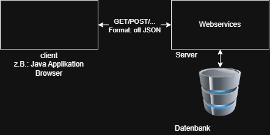

# SEW 2026/27

## RESTful Webservice

Webservices bieten die Möglichkeit Dienste, die ein Server zu Verfügung stell anzusprechen. RESTful Webservices folgen den REST Grundprinzipien. 

Zu diesen zählen: Einfeutige Identifikation von Resourcen:

z.B.: https://shop.thlhl.at/products/67

Verwendung von http - Standardmethoden:

z.B.: GET, POST, PUT, PATCH, DELETE

Analogie objektorientierte Methodevs. RESTful Webservices

​	getUsers()	GET	https://shop.htlhl.at/users

​	updateUser(int id, User user)	PATCH	https://shop.thlhl.at/users/{id}

​	addUser(User user)	POST	https://shop.thlhl.at/users

​	deleteUser(ist id)	DELETE	https://shop.thlhl.at/users/{id}

Statuslose KOmmunikation:

Bei RESTful Webservices gibt es keinen Sitzungsstatus der serverseitig gespeichert wird. Stattdessen muss der Kommunikatiosnzustand im Client gespeichert werden.

​	Vorteile: Neustart des Servers, Skaliebarkeit

## HTTP Client in Java

Java besitzt seit der Version 11 ein modernes HTTP Client API. Dieses ersetzt die Klasse HttpURIConnection, die früher in Java für die HTTP-Kommunikation zuständig war. 

Das API befindet sich im Package `java.net.http` und besteht aus folgenden Klassen bzw. Interfaces:

### Http Request:

Mit dieser Klasse ist es möglich, vollständige HTTP-Methodenaufrufe (GET, POST, ...) - inkl. URL und Daten zu erstellen. Dabei nutzt die Klasse das Builder-Pattern (=Entwurfsmuster).

### Http Client:

Alle mit HttpRequest ertellten Anfragen werden mittels HttpClient gesendet. Wobei diese sowohl synchron als auch asynchron abgesetzt werden können. Synchron bedeutet, das der Aufruf auf das Ergebnis wartet (blockierend). Asynchron bedeutet, das nicht auf das Ergebnis gewartet wird, sondern die nächstfolgende Codezeile sofort ausgeführt wird (nicht blockierend). 

### Http Response:

Diese Klasse repräsentiert die Antwort des Servers. Sie bietet viele hilfreiche Methoden, die richtigsten aber sind:

- `statusCode()` : Liefert den StatusCoder der Antwort
- `body()` : Liefert die Datender Anfrage

Weitere Infos, siehe https://www.baeldung.com/java-9-http-client sowie die Java API-Doc https://docs.oracle.com/en/java/javase/11/. 
